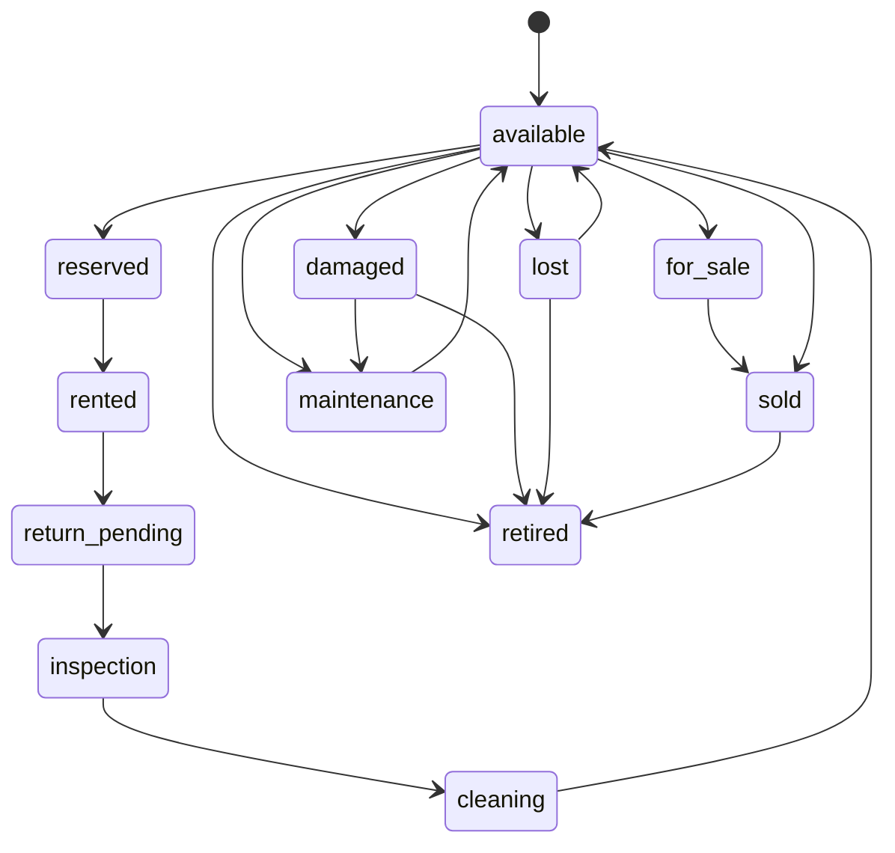

# Backend V2 Inventory Design (Phase 4.1–4.4)

**Branch:** `backend-v2`  
**Module:** `backend-node/src/inventory`  
**Role:** Generic Item Catalog + authoritative operational lifecycle + integrity guarantees.

## Scope

**In scope:** Category, Brand, Color, Size, Item CRUD; soft delete/restore; search/filter; MediaReference attachments + ItemBarcode; **lifecycle state machine** + history + availability predicates; Phase 4.4 integrity remediation.

**Out of scope:** reservations, rentals, availability calendar, penalties, laundry/inspection workflows, payments (**sales execution is Phase 6.7 — see SalesDesign.md**).

## Two status dimensions

| Dimension | Field | Purpose |
|-----------|--------|---------|
| Catalog | `status` | draft / active / inactive / archived / retired |
| Lifecycle | `lifecycleState` | Operational machine used by future rentals/sales |

Future modules **must** call `LifecycleService.transition` — never invent parallel state machines.

**Draft protection:** only `status=active` items may transition lifecycle. Draft items never enter operational flow.

## Soft-delete / restore integrity

Soft-delete is **rejected** (409) when lifecycle ∈  
`reserved | rented | return_pending | inspection | cleaning | maintenance`.

On allowed soft-delete (single transaction):

1. Capture `statusBeforeDelete`, set catalog `status=inactive`, set `deletedAt`
2. Soft-delete `ItemBarcode` rows
3. **Release** bound barcodes (`activated` → `reserved`, clear entity binding)
4. Soft-delete `MediaReference` rows for the item

On restore (single transaction):

1. Restore row; catalog `status` ← `statusBeforeDelete` (or `active` if prior was inactive/missing)
2. Restore `ItemBarcode` links
3. Re-activate barcodes onto the item
4. Restore media references

Lifecycle state is **not** mutated by delete/restore.

## Create integrity

`ItemsRepository.createAtomic` persists in one transaction:

- Item
- Barcode activation + `ItemBarcode` (optional)
- `MediaReference` rows (optional create-time `media[]`)
- Birth `ItemStateHistory`

## Media strategy (single)

**MediaReference only** (platform). `ItemMedia` removed. Inventory never dual-writes attachment tables.

## Lifecycle states

`available` · `reserved` · `rented` · `return_pending` · `inspection` · `cleaning` · `maintenance` · `for_sale` · `sold` · `retired` · `lost` · `damaged`

### Primary path



Invalid edges are rejected (409). Concurrent transitions use CAS (`updateMany` where current state matches).

## Service

`transition` · `canTransition` · `currentState` · `history` · `recordCreated`

Availability helpers (no booking):

- `isOperational()` — requires active catalog status (not draft)
- `isRentable()` — active catalog + `available`
- `isSellable()` — active + `available` | `for_sale`
- `isEditable()` — catalog fields when lifecycle allows

## HTTP

| Method | Path | Permission |
|--------|------|------------|
| GET | `/items/:id/state` | inventory.view |
| GET | `/items/:id/history` | inventory.view |
| POST | `/items/:id/transition` | inventory.transition |

Body: `{ newState, reason?, referenceType?, referenceId?, expectedState? }`

## History

`ItemStateHistory`: old/new state, reason, user, optional reference entity, timestamp.

## Architecture

```
Item ──► Category / Brand / Color / Size
     ──► MediaReference ──► MediaFile   (sole attachment strategy)
     ──► ItemBarcode ──► Barcode
     ──► ItemStateHistory (append-only)
```

## Remediation

See `PHASE_4_REMEDIATION_REPORT.md` (Phase 4.4).

## Coverage

```bash
pnpm test:cov:inventory
```
