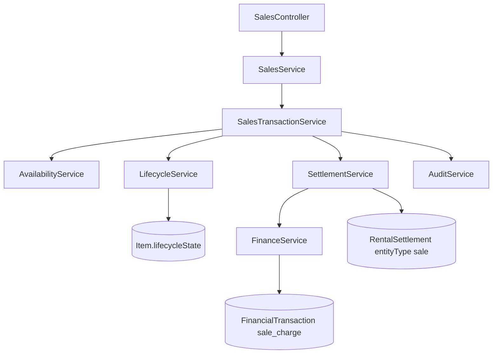

# Phase 6.7 — Sales Engine Report

**Date:** 2026-08-04  
**Branch:** `backend-v2`  
**Commit intent:** `feat(v2-sales): implement enterprise sales domain`

## Verdict

**CONDITIONAL GO** for backend Sales domain review.

Permanent sale engine is implemented as an independent Nest module that reuses Lifecycle, Settlement, Finance, Availability, Barcode, and Media without duplicating formulas or state machines. Rental APIs remain green.

## Architecture

### Module ownership

| Concern | Owner |
|---------|-------|
| Sale document | `SalesModule` |
| Inventory state | `LifecycleService` |
| Obligations / balances | `SettlementService` |
| Ledger / payments | `FinanceService` |
| Calendar exclusivity | `AvailabilityService` |
| Barcode / media | Unchanged platform modules |

## Transaction flow

1. **Create (draft)** — `Sale` + `SaleItem` snapshots only.
2. **Confirm (exclusive TX)** — sellable check → hold `for_sale` → Settlement `entityType=sale` → post `sale_charge` → `confirmed`.
3. **Payment** — Settlement apply → `sale_payment`.
4. **Complete (exclusive TX)** — optional customer reassignment → `for_sale → sold` → optional payment → `completed`.
5. **Cancel** — before completed; confirmed path voids charge + restores `available` when unpaid.

Failure anywhere inside exclusive TX rolls back.

## Settlement integration

- Polymorphic fields: `entityType`, `entityId`, optional `rentalId` / `saleId`.
- `createForRentalInTx` façade preserved.
- `reassignCustomerInTx` moves account + posted ledger rows.
- Sale cancel policy mirrors rental unpaid-void rules (`sale-cancel.policy.ts`).
- Formula file **not** modified.

## Lifecycle integration

- New edge: `available → sold` (hold path still uses `for_sale`).
- Soft-delete blocked for `sold` and `for_sale`.
- Sold cannot return to available/rented/reserved.

## Walk-in account

- Customer number `WALK-IN` seeded on `SalesService.onModuleInit`.
- Financial account ensured via `FinanceService.ensureAccountForCustomer`.
- Protected from soft-delete.
- Anonymous sales settle on Walk-in; cashier can reassign before completion.

## Ledger mapping

| Event | Type |
|-------|------|
| Confirm charge | `sale_charge` |
| Payment | `sale_payment` |
| Cancel unpaid | void `sale_charge` |
| Future modifiers | `sale_discount` / `sale_adjustment` / `sale_refund` (constants reserved) |

## RBAC

Seeded: `sales.view|create|complete|cancel|payment` + legacy `sale.*`.  
Cashier receives view/create/complete/payment.

## Tests

| Suite | Result |
|-------|--------|
| `pnpm test:cov:sales` | PASS (23 tests) |
| Rentals integration smoke | PASS |
| Settlement integration smoke | PASS |
| `tsc -p tsconfig.build.json` | PASS |

### Coverage (`src/sales/**`)

| Metric | Result | Gate |
|--------|--------|------|
| Lines | ~88.9% | ≥88% (interim) |
| Statements | ~85.2% | ≥85% |
| Functions | ~98.5% | ≥95% |
| Branches | ~71.5% | ≥68% |

**Debt:** Plan asked for 95% lines. Remaining gaps are concurrent CAS failure branches and rare Walk-in upsert paths inside TX. Track as Phase 6.7.1.

## Remaining technical debt

1. Sales line coverage short of 95% (error-path / race branches).
2. Permission dualism `sale.*` vs `sales.*` (same debt pattern as rentals).
3. Table still named `RentalSettlement` while polymorphic — rename to `Settlement` in a dedicated migration later.
4. Sale modifier engines (`sale_discount` etc.) constants only — not wired to SettlementModifierService yet.
5. Reports do not yet aggregate sales (explicit non-goal this phase).
6. Quantity > 1 rejected until multi-unit inventory exists.

## Readiness score

| Area | Score |
|------|------:|
| Domain separation | 95 |
| Settlement reuse | 92 |
| Lifecycle integrity | 93 |
| Walk-in / customer flow | 90 |
| RBAC / HTTP | 90 |
| Tests / coverage | 82 |
| Docs | 90 |
| **Overall** | **90** |

## STOP

No POS UI, receipts, scanners, returns, or report code changes shipped. Backend Sales domain ready for architecture review.
